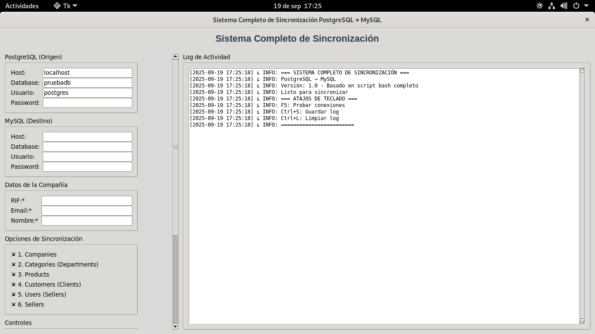
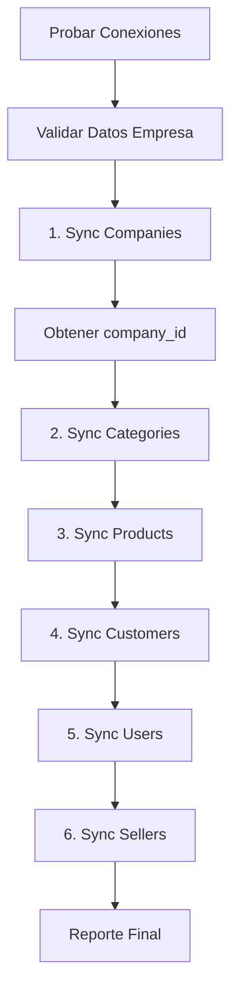

# 🔄 Sistema Completo de Sincronización PostgreSQL → MySQL

Aplicación de escritorio desarrollada en Python con interfaz gráfica moderna para sincronizar bases de datos PostgreSQL hacia MySQL de forma completa y automatizada.


### 🏠 Panel Principal


## 🚀 Características Principales

### ✨ **Interfaz Moderna**
- **Tkinter nativo** con estilos personalizados
- **Ventana redimensionable** con scroll automático
- **Panel dual**: Configuración (izquierda) + Log en tiempo real (derecha)
- **Indicadores visuales** de progreso y estado
- **Atajos de teclado** para funciones principales

### 🏢 **Gestión Completa de Datos**
- **6 módulos de sincronización**:
  1. 🏢 **Companies** (obligatorio para obtener company_id)
  2. 📂 **Categories** (departments → categories)
  3. 📦 **Products** (con precios, stock, JOINs completos)
  4. 👥 **Customers** (clients → customers)
  5. 👤 **Users** (sellers como role='seller')
  6. 🛍️ **Sellers** (con relaciones user_id y company_id)

### 🔧 **Configuración Flexible**
- **Datos de empresa personalizables** (RIF, email, nombre)
- **Conexiones de BD independientes** (PostgreSQL origen, MySQL destino)
- **Validación en tiempo real** de RIF venezolano y email
- **Detección de duplicados** automática

### 📊 **Monitoreo Avanzado**
- **Log en tiempo real** con timestamps y códigos de colores
- **Barra de progreso** para sincronización
- **Prueba de conexiones** antes de sincronizar
- **Exportar/guardar logs** en archivos

## 📋 Requisitos del Sistema

### **🐍 Python**
```bash
# Verificar versión (mínimo 3.7)
python --version
python3 --version
```

### **🗄️ Clientes de Base de Datos**
```bash
# Ubuntu/Debian
sudo apt-get install python3-tk postgresql-client mysql-client

# CentOS/RHEL
sudo yum install python3-tkinter postgresql mysql

# Windows
# Python incluye tkinter
# PostgreSQL y MySQL: instalar desde sitios oficiales
```

### **📦 Dependencias Python** (se instalan automáticamente)
- `mysql-connector-python==8.2.0`
- `psycopg2-binary==2.9.7`
- `pyinstaller==6.1.0` (solo para compilar ejecutables)
- `pillow==10.1.0`

## 🛠️ Instalación

### **Método 1: Ejecución desde Código (Recomendado para desarrollo)**

```bash
# 1. Clonar/descargar el proyecto
git clone <tu-repositorio> sync-app
cd sync-app

# 2. Crear entorno virtual (recomendado)
python3 -m venv venv

# 3. Activar entorno virtual
# Linux/macOS:
source venv/bin/activate
# Windows:
venv\Scripts\activate

# 4. Instalar dependencias
pip install -r requirements.txt

# 5. Ejecutar aplicación
python app.py
```

### **Método 2: Ejecutable Pre-compilado**

#### **🪟 Windows**
```bash
# Descargar y ejecutar directamente
CompanyRegistration.exe

# O usar el script automático de compilación
batwindows.bat
```

#### **🐧 Linux**
```bash
# Hacer ejecutable y correr
chmod +x CompanyRegistration
./CompanyRegistration

# O usar script de compilación
chmod +x build_scripts/build_linux.sh
./build_scripts/build_linux.sh
```

### **Método 3: Compilar tu Propio Ejecutable**

#### **🪟 Para Windows (desde Windows)**
```batch
# Ejecutar script automático
batwindows.bat
```

#### **🐧 Para Linux**
```bash
# Activar entorno virtual
source venv/bin/activate

# Ejecutar script de compilación
chmod +x build_scripts/build_linux.sh
./build_scripts/build_linux.sh
```

## ⚙️ Configuración

### **1. 🏢 Datos de la Empresa (Obligatorio)**
```
RIF:    J502741283                    # Formato: J/V/E/G/C + 8-9 dígitos
Email:  empresa@ejemplo.com           # Email válido corporativo
Nombre: EMPRESA EJEMPLO, C.A.         # Razón social completa
```

### **2. 🐘 PostgreSQL (Base de Datos Origen)**
```
Host:     localhost                   # IP o hostname del servidor
Database: pruebadb                    # Nombre de la base de datos
Usuario:  postgres                    # Usuario con permisos de lectura
Password:                             # Contraseña del usuario
```

### **3. 🐬 MySQL (Base de Datos Destino)**
```
Host:                                # IP del servidor MySQL
Database: chrystal_movil             # Base de datos destino
Usuario:  chrystal_app               # Usuario con permisos de escritura
Password:                            # Contraseña del usuario
```

## 🎯 Uso Paso a Paso

### **Paso 1: Configurar Conexiones**
1. Abrir la aplicación
2. **Configurar PostgreSQL** (origen):
   - Llenar host, database, usuario, password
3. **Configurar MySQL** (destino):
   - Llenar host, database, usuario, password
4. **Probar Conexiones** (botón) ✅
   - Verificar que ambas conexiones sean exitosas

### **Paso 2: Configurar Empresa**
1. **RIF**: Introducir RIF venezolano válido (J502741283)
2. **Email**: Correo corporativo (empresa@ejemplo.com)
3. **Nombre**: Razón social completa
4. **Validación automática** en tiempo real

### **Paso 3: Seleccionar Módulos**
- ✅ **Companies** (obligatorio - genera company_id)
- ✅ **Categories** (departments → categories)
- ✅ **Products** (productos con precios y stock)
- ✅ **Customers** (clients → customers)
- ✅ **Users** (sellers como users)
- ✅ **Sellers** (sellers con relaciones)

### **Paso 4: Ejecutar Sincronización**
1. **"Iniciar Sincronización Completa"** 🚀
2. **Monitorear progreso** en el log
3. **Esperar finalización** (puede tomar minutos dependiendo del volumen)
4. **Verificar resultados** en el log final

## 🔍 Funcionalidades Avanzadas

### **🔐 Validaciones**
```python
# RIF Venezolano
Formato: [J|V|E|G|C] + 8-9 dígitos
Ejemplo: J502741283, V123456789

# Email
Formato: usuario@dominio.extensión
Validación: expresión regular estricta

# Duplicados
Detección automática por RIF en companies
Actualización en lugar de inserción duplicada
```

### **🔄 Proceso de Sincronización**


### **📊 Mapeo de Datos**
| PostgreSQL | MySQL | Descripción |
|------------|-------|-------------|
| `company` | `companies` | Datos de empresa |
| `department` | `categories` | Categorías con company_id |
| `products + PRODUCTS_UNITS + products_stock` | `products` | JOINs completos |
| `clients` | `customers` | Clientes con company_id |
| `users + sellers` | `users` | Users con role='seller' |
| `sellers` | `sellers` | Sellers con user_id y company_id |

### **⚙️ Opciones Avanzadas**
```bash
# Atajos de Teclado
F5           # Probar conexiones
Ctrl+S       # Guardar log
Ctrl+L       # Limpiar log

# Archivos Generados
*.log        # Logs de ejecución
*.spec       # Configuración PyInstaller
dist/        # Ejecutables compilados
build/       # Archivos temporales de compilación
```

## 🔧 Solución de Problemas

### **❌ Error: "No se puede conectar a PostgreSQL"**
```bash
# Verificar servicio
sudo systemctl status postgresql

# Probar conexión manual
psql -h localhost -U postgres -d pruebadb -c "SELECT 1;"

# Verificar pg_hba.conf (autenticación)
sudo nano /etc/postgresql/*/main/pg_hba.conf
```

### **❌ Error: "No se puede conectar a MySQL"**
```bash
# Verificar servicio
sudo systemctl status mysql

# Probar conexión manual
mysql -h 91.238.160.176 -u chrystal_app -p chrystal_movil -e "SELECT 1;"

# Verificar firewall
telnet 91.238.160.176 3306
```

### **⚠️ Error: "RIF inválido"**
```
Formato correcto: J502741283
                  ^         ^
                  Letra     8-9 dígitos

Letras válidas: J, V, E, G, C
Sin guiones, espacios o caracteres especiales
```

### **🐛 Error: "Falta tkinter"**
```bash
# Ubuntu/Debian
sudo apt-get install python3-tk

# CentOS/RHEL
sudo yum install tkinter

# Verificar instalación
python3 -c "import tkinter; print('✅ tkinter OK')"
```

### **🔄 Error durante sincronización**
```bash
# Ver log detallado en la aplicación
# O ejecutar desde terminal para ver errores:
python app.py

# Verificar permisos de BD
# PostgreSQL: SELECT (lectura)
# MySQL: INSERT, UPDATE, SELECT (escritura)
```

## 📁 Estructura del Proyecto

```
sync-app/
├── app.py                          # Aplicación principal ⭐
├── requirements.txt                # Dependencias Python
├── .gitignore                      # Archivos ignorados por Git
├── README.md                       # Esta documentación
├── CompanyRegistration.spec        # Config PyInstaller
├── assets/                         # Recursos gráficos
│   └── icon.ico                   # Icono de la aplicación
├── build_scripts/                  # Scripts de compilación
│   ├── batwindows.bat             # Compilar en Windows
│   ├── build_linux.sh             # Compilar en Linux
│   ├── build_windows.sh           # Compilar .exe desde Linux
│   └── app.spec                   # Configuración avanzada
├── dist/                          # Ejecutables compilados
│   └── CompanyRegistration.exe    # Ejecutable Windows
├── build/                         # Archivos temporales (ignorar)
├── venv/                          # Entorno virtual (ignorar)
└── logs/                          # Logs de ejecución (ignorar)
```

## 🚀 Distribución

### **📦 Crear Paquete Completo**
```bash
# Para distribución a otros usuarios
tar -czf sistema-sincronizacion-v1.0.tar.gz \
    app.py requirements.txt README.md \
    assets/ build_scripts/

# Descomprimir en destino
tar -xzf sistema-sincronizacion-v1.0.tar.gz
cd sistema-sincronizacion-v1.0/
python app.py
```

### **💿 Ejecutable Portable**
```bash
# Windows: Distribuir solo el .exe
CompanyRegistration.exe  # ~15-30 MB

# Linux: Distribuir ejecutable + assets
chmod +x CompanyRegistration
./CompanyRegistration
```

## 🔐 Consideraciones de Seguridad

### **🔑 Credenciales**
- Las contraseñas se muestran ocultas en la interfaz (`show="*"`)
- **No se almacenan** en archivos de configuración
- Se mantienen solo en memoria durante la ejecución
- **Recomendación**: Usar usuarios de BD con permisos mínimos necesarios

### **🌐 Conexiones de Red**
- Conexiones directas a las bases de datos (sin proxy)
- **Verificar firewall** para puertos 5432 (PostgreSQL) y 3306 (MySQL)
- **Usar SSL/TLS** cuando sea posible en producción

### **📊 Datos Sensibles**
- Los logs pueden contener información de la empresa
- **Limpiar logs regularmente** con el botón correspondiente
- **No compartir logs** que contengan información confidencial

## 🤝 Contribución y Desarrollo

### **🔧 Desarrollo Local**
```bash
# Clonar proyecto
git clone <repositorio>
cd sync-app

# Instalar en modo desarrollo
pip install -e .

# Ejecutar tests (si existen)
python -m pytest tests/

# Formatear código
black app.py
flake8 app.py
```

### **📝 Agregar Nuevos Módulos**
1. Crear función `sync_nuevo_modulo()` en `app.py`
2. Agregar checkbox en la interfaz
3. Integrar en `complete_sync_process()`
4. Actualizar documentación

### **🐛 Reportar Problemas**
- Incluir versión de Python y sistema operativo
- Adjuntar log completo del error
- Describir pasos para reproducir el problema
- Verificar que no sea un problema de conexión de red

## 📄 Licencia y Créditos

```
Sistema Completo de Sincronización PostgreSQL → MySQL
Desarrollado en Python con Tkinter

Versión: 1.0
Autor: Tu Nombre
Licencia: MIT

Dependencias principales:
- Python 3.7+
- mysql-connector-python
- psycopg2-binary
- tkinter (incluido con Python)
```

## 🆘 Soporte

### **📧 Contacto**
- **Email**: soporte@tu-empresa.com
- **GitHub Issues**: [Reportar problemas](https://github.com/tu-usuario/sync-app/issues)
- **Documentación**: [Wiki completa](https://github.com/tu-usuario/sync-app/wiki)

### **🎓 Recursos Adicionales**
- [Tutorial de PostgreSQL](https://www.postgresql.org/docs/)
- [Documentación MySQL](https://dev.mysql.com/doc/)
- [Guía Python/Tkinter](https://docs.python.org/3/library/tkinter.html)

---

## 🎉 ¡Comienza Ahora!

```bash
# Instalación rápida
git clone <tu-repositorio> sync-app
cd sync-app
python3 -m venv venv
source venv/bin/activate  # Linux/macOS
pip install -r requirements.txt
python app.py
```

**¡Tu sincronización PostgreSQL → MySQL nunca fue tan fácil! 🚀**

---

### 📊 Estado del Proyecto

| Característica | Estado | Notas |
|---|---|---|
| ✅ Interfaz gráfica | Completado | Tkinter con estilos modernos |
| ✅ Conexión PostgreSQL | Completado | psycopg2 con validación |
| ✅ Conexión MySQL | Completado | mysql-connector con pooling |
| ✅ Sincronización Companies | Completado | Con validación RIF y duplicados |
| ✅ Sincronización Categories | Completado | Departments → Categories |
| ✅ Sincronización Products | Completado | JOINs completos con precios |
| ✅ Sincronización Customers | Completado | Clients → Customers |
| ✅ Sincronización Users | Completado | Role='seller' automático |
| ✅ Sincronización Sellers | Completado | Con user_id y company_id |
| ✅ Logging avanzado | Completado | Timestamps y códigos de colores |
| ✅ Compilación ejecutables | Completado | Windows (.exe) y Linux |
| 🔄 Programación tareas | En desarrollo | Cron/Task Scheduler |
| 📧 Notificaciones email | Planificado | Para errores y completación |